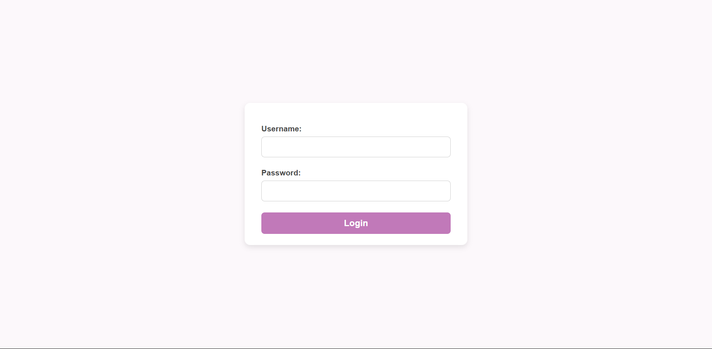
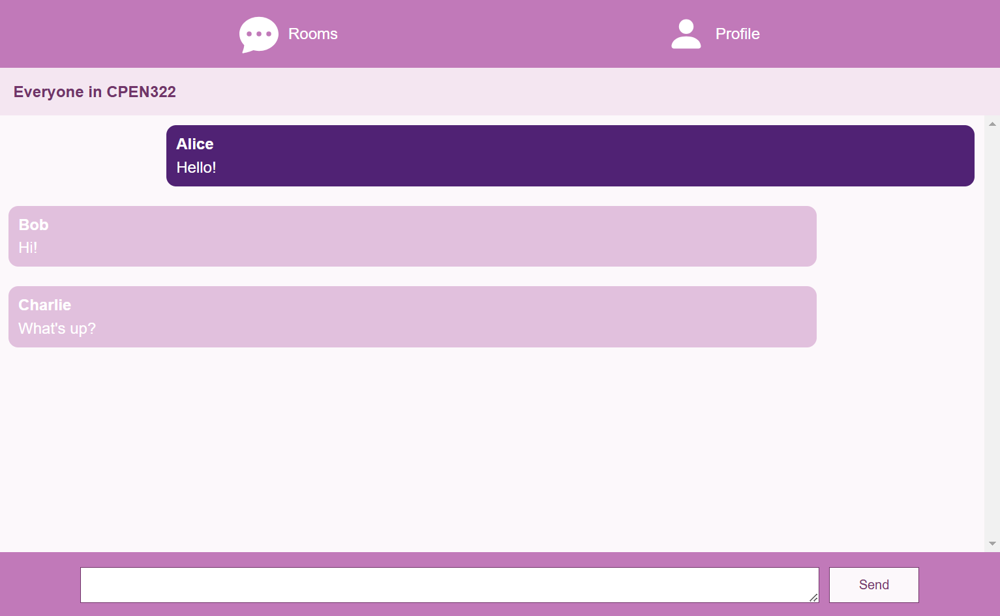

# Chat-Web-application

### The main focus of this app was to further enhance my skills in backend development with JavaScript and Node.js. 

### Logistics

- Developled a dynamic, real-time chat application using **HTML**, **CSS**, and **JavaScript** for the front end

- Utilized the **Model-View-Controller (MVC)** design pattern by structuring components into distinct layers to handle user input and interactions, ensuring a seamless and dynamic frontend experience

- Implemented a robust back end using **JavaScript frameworks** such as **Node.js**, **Express.js**, and **WebSockets** to handle real-time messaging and user interactions efficiently

- Incorporating **RESTful APIs** to manage user authentication, chat room creation, and message history, with data stored and maintained in **MongoDB** for efficient retrieval

To view the app please clone the repository and install all the node dependencies by running "npm i". After this is complete, please type the command "node server.js" which will start a local server on your computer at port 3000. Finally, open a new tab in a browser of your choice and type "http://localhost:3000/".

### Future add ons

- Implement an **AI** feature into the app to modernize it by utilizing new technologies

- Create functionality of the profiles tab in the app

- Further improve upon media queries to ensure better UX

 

---
  

